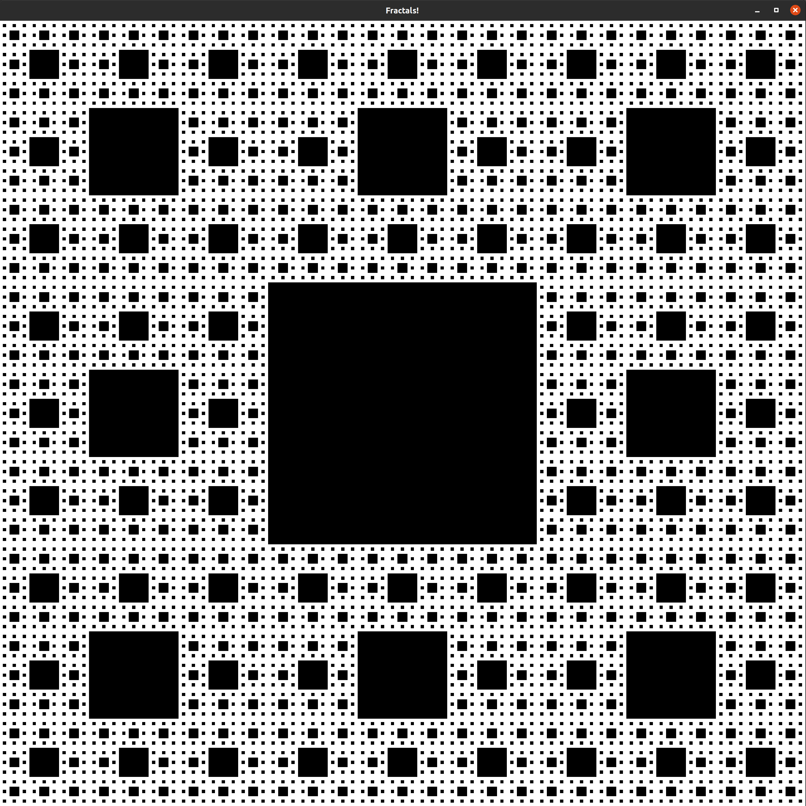

# Fractals

In this project you can test some fractals in c++.
For now press any key to iterate.

## Dependencies
g++
sudo apt install libsfml-dev

## How to compile
g++ -c main.cpp sierpinski.cpp fractal.cpp

## How to link
g++ main.o sierpinski.o fractal.o -o fractals -lsfml-graphics -lsfml-window -lsfml-system

## Compile, link and run
g++ -c main.cpp sierpinski.cpp fractal.cpp &&
g++ main.o sierpinski.o fractal.o -o fractals -lsfml-graphics -lsfml-window -lsfml-system &&
 ./fractals