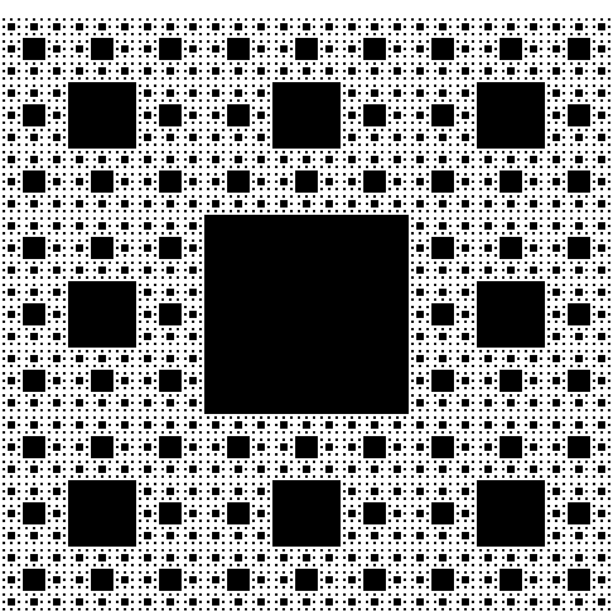
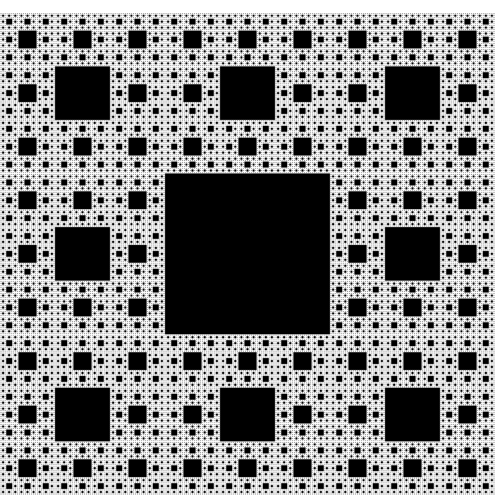
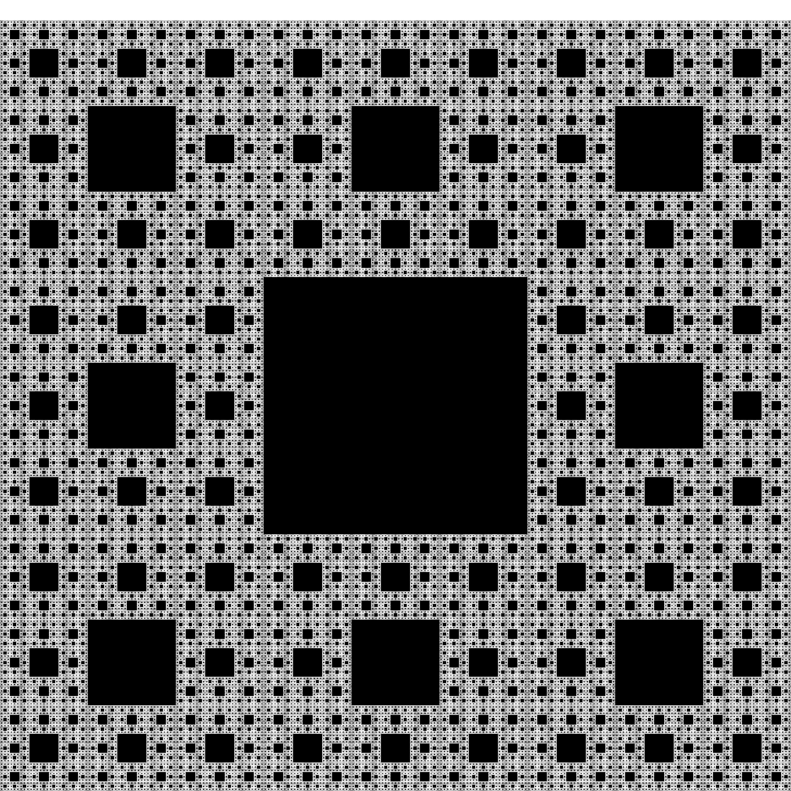
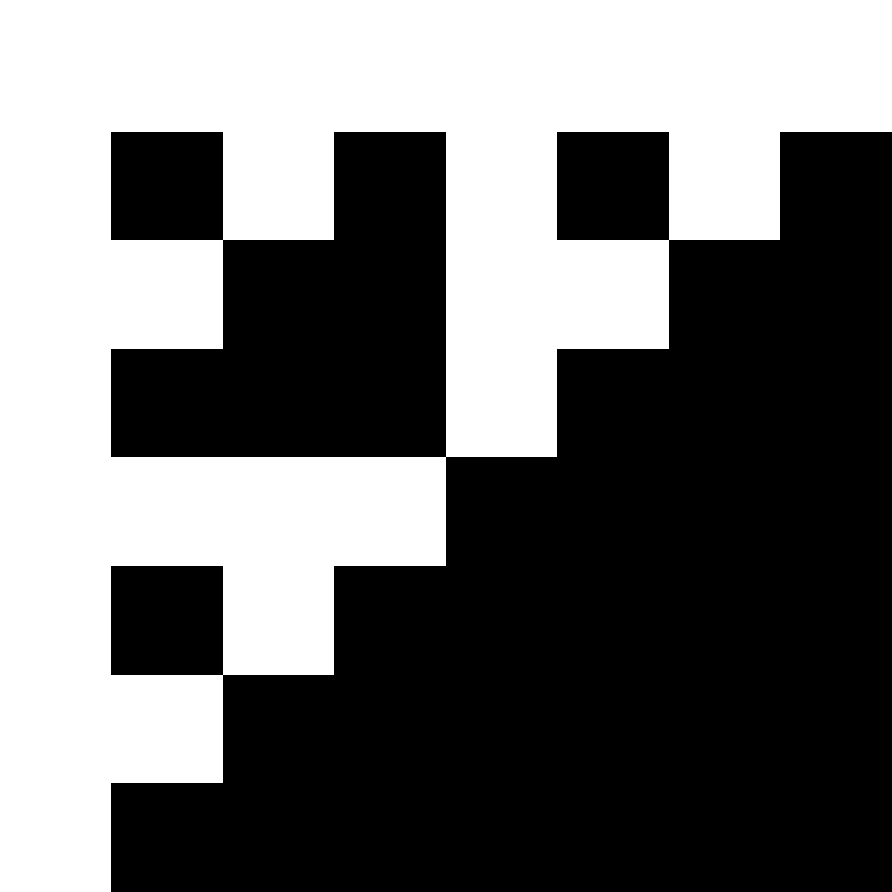
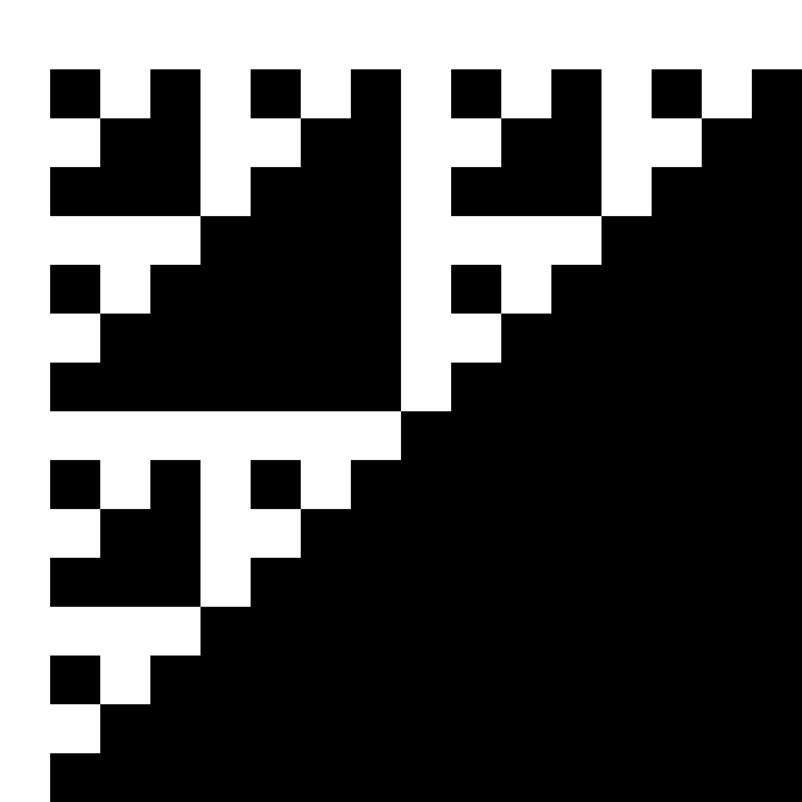
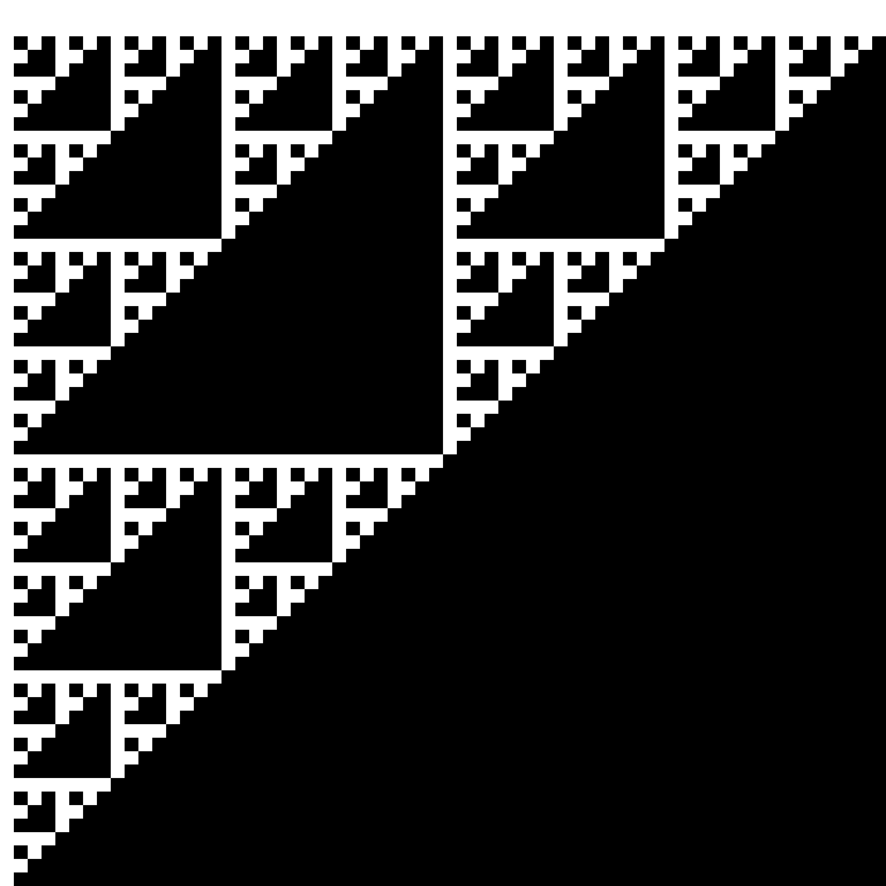

# Fractals
# Sierpinski Carpet






# Sierpinski Triangle








## Controls
* Space to iterate
* 1 for Sierpinski Carpet
* 2 for Sierpinski Triangle
* S to save a screenshot
* Escape to exit or clicking close window

## Dependencies
```
sudo apt install g++
sudo apt install libsfml-dev
```

## Compile, link and run
```
g++ -o fractalsInCpp src/*.cpp src/fractals/*.cpp -lsfml-graphics -lsfml-window -lsfml-system
./fractalsInCpp
```
